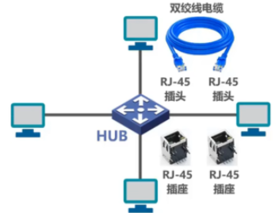

## 数据链路层概述

`链路`（Link）就是从一个结点到相邻结点的一段物理线路，而中间没有任何其他的交换结点。
`数据链路`（Data Link）是指把实现通信协议的硬件和软件加到链路上，就构成了数据链路。
数据链路层以`帧`为单位传输和处理数据。

### 数据链路层解决的几个重要问题

1.  封装成帧
2.  差错检测
3.  可靠传输

#### 封装成帧

把网络层传递下来的 SDU 添加帧头和帧尾的动作被称为封装成帧。

#### 差错检测

传输的数据可能由于扰动，产生误码。差错检测的目的就是检查收到的帧是否出现了误码，没有则接收，有误码则丢弃，再根据是否提供可靠传输要求对方重传。

发送方会在封装成帧这个步骤中，往帧尾添加检错码，接收方在收到帧后，会根据检错码和检测算法，判断帧在传输过程中是否出现了乱码。

#### 可靠传输

尽管误码是不能完全避免的，但若能实现发送方发送什么,接收方就能收到什么，就称为可靠传输。

## 封装成帧

封装成帧是指数据链路层给上层交付的协议数据单元添加帧头和帧尾使之成为帧。
    帧头和帧尾中包含有重要的控制信息。

### 如何界定一个帧？

发送方成功发送了帧，那么问题来了，接收方改怎么接收帧呢？换句话说，接收方怎么才能知道接收到的比特流`哪里是帧的开头，哪里是帧的结束`？

常见的方式有两种，一种是`帧定界符`，一种是`前导码技术`。

#### 帧定界符

以PPP 协议帧举例，PPP帧在封装时会在帧头和帧尾加上一个字节长的定界符，接收方在接收比特流时可以根据定界符判断帧的起始。

#### 前导码

以以太网V2的Mac 帧举例，它并不会在数据链路层做定界符，而是将帧发送给物理层处理，物理层在帧的头部加上八个字节的前导码，其中前七个为同步码，作用是同步时间间隔，后一个字节是定界符，作用和帧定界符相同，同时以太网 V2 协议还约定每一个Mac 帧中间要有96个比特的发送时间。

### 透明传输

无论是帧定界符还是前导码，都会面临一个问题，就是如果发送数据中恰好有一段比特流和定界符相同怎么办？接收方要如何避免这部分误判？是不是要限制上层不要发送这部分带有定界符的内容？这就要引出透明传输的概念了。

透明传输指的是数据链路层对上层传输的 SDU 内容不做任何限制，就好像数据链路层不存在一样。那么发送带有界定符的数据时该怎么办？

#### 字符填充

面向字节的物理链路会用字节填充（或称字符填充）的方式实现透明传输。

面向字节的物理链路在发送封装数据时，会对数据进行扫描，如果数据中恰好有一段和定界符相同，那么数据链路层会为在这段比特流前`加上转义符`（十进制27）。这样接收方就能通过前面的转义符判断出这段比特流不是真正的定界符，并丢弃发送发加上的转义符，获取真正的数据。同时，为了避免接收方误删原本数据流中就存在的转义符，发送方会为转义符前面也加上转义符。

#### 比特填充

面向比特的物理链路使用比特填充的方式完成透明传输。

以下图为例，我们假定定界符为 01111110，中间足足有六个1，根据这个定界符的特征，我们可以扫描数据部分的比特流，将比特流中出现五个1的后面统统加上0，这样就避免了数据部分和定界符的误判。而接收方只要在接收比特流时删除连续出现的五个1后面的0，就能还原数据部分了。

## 差错检测

实际的通信链路都不是理想的，比特在传输过程中可能会产生差错：1可能会变成0,
而0也可能变成1。这称为`比特差错`。

在一段时间内，传输错误的比特占所传输比特总数的比率称为`误码率BER(`Bit Error Rate)。

使用`差错检测码`来检测数据在传输过程中是否产生了比特差错，是数据链路层所要解决的
重要问题之一。

### 奇偶校验

在待发送的数据后面`添加1位奇偶校验位`，使整个数据（包括所添加的校验位在内）中“1”的个数
为奇数（奇校验）或偶数（偶校验）。

如果有`奇数个位发生误码`，则奇偶性发生变化，`可以检查出误码`；

如果有`偶数个位发生误码`，则奇偶性不发生变化，`不能检查出误码（漏检）`;

### 循环冗余校验CRC（Cyclic Redundancy Check）

* 基本步骤：
    1. 收发双方约定好一个`生成多项式G(x)`;
    2. 发送方基于待发送的数据和生成多项式计算出差错检测码（冗余码），将其添加到待传输数据的后面一起传输;
    3. 接收方通过生成多项式来计算收到的数据是否产生了误码;

#### 举例

## 可靠传输

* 使用`差错检测技术`（例如循环冗余校验CRC），接收方的数据链路层就可检测出帧在传输过程中是否产生了`误码`（比特错误）。

* 数据链路层向上层提供的服务类型：
    `不可靠传输服务`：`仅仅丢弃有误码的帧`，其他什么也不做;
    `可靠传输服务`：想办法实现`发送端发送什么，接收端就收到什么`。

* 一般情况下，`有线链路`的误码率比较低，为了减小开销，并`不要求数据链路层`向上提供`可靠`传输服务。即使出现了误码，可靠传输的问题由其上层处理。

* `无线链路`易受干扰，误码率比较高，因此`要求数据链路层`必须向上层提供`可靠`传输服务。

* `比特差错`只是传输差错中的一种。

* 从整个计算机网络体系结构来看，传输差错还包括`分组丢失`、`分组失序`以及`分组重复`。

* 分组丢失、分组失序以及分组重复这些传输差错，一般不会出现在数据链路层，而会出现在其上层。

* `可靠传输服务并不仅局限于数据链路层`，其他各层均可选择实现可靠传输。

### 几种可靠传输的实现机制

#### 停止-等待协议SW（Stop-Wait）

发送方发送数据包之后，等待接收方接收，接收方接收之后返回一个ACK 信号，发送方收到ACK 信号，确认接收方已经接收上一个包，开始发送下一个包，如果数据包在传播过程中发生误码，接收方会丢弃该数据包，并发送一个 NAK 信号，示意发送方重新发送这个误码的包。

数据包在传输过程中不止会出现误码，还可能出现丢包，如果是数据包出现丢失，接收方不知道这个包的存在，无法发送重发信号要求发送方重传，因此，发送方需要有一个机制重发丢失的数据包。发送方会设置一个重发时间，超出重发时间没有收到确认信号就会重新发送一个数据包。

如果是接收方发送的确认信号丢失，发送方也会重新发送一个数据包，那接收方就会收到两个一样的数据包，造成数据重复。为了解决这个问题，发送方会在发送数据包时带上一个序号，接受方收到了两个重复序号的数据包就能判断出是数据重复发送了，丢弃一个即可。又因为停止-等待协议的发送方在收到确认信号前不会发送下一个数据包，所以，数据包的信号只要区分于下一个数据包即可，事实上，现实网络中这个序号一般大小为一个bit，用0和1来表示即可。

数据包需要一个序号来区分，确认信号同理，在复杂的网络环境中，有可能出现发送方在没有出现丢包的情况下发送两个相同的数据包（原始包由于网络阻塞迟到，发送方超出超时等待时间发送重传包），这种情况下接收方会对两个数据包发送两个确认信息，如果确认信号没有序号标识，那么发送方就有可能误以为两个确认信号中有一个是其他数据包的确认信号。与数据包同理，确认信号的序号也只需要一个比特，用来标识前后两个数据包即可。

停止-等待协议的缺点是等待时间导致的**信道利用率低**。

#### 回退N帧协议GBN（Go-Back-N）

回退N帧协议会在传输数据之前先定义发送窗口的大小，也就是发送方一次发送多少个分组。比如，假定采用三个比特的大小来标识序号，那么发送窗口的大小取值就为 1 < N < 2n-1，其中 n 表示比特位数，当 N = 1 时，等同于停止等待协议，当 N = 2n 时接收方无法分辨新旧分组。

#### 选择重传协议SR（Selective Request）

## 点对点协议PPP

点对点协议PPP（Point to Point Protocol）是目前使用最广泛的点对点数据链路层协议

PPP协议为在点对点链路传输各种协议数据报提供了一个标准方法，主要由以下三部分构成：
1. 对各种协议数据报的封装方法（`封装成帧`)
2. 链路控制协议LCP（用于`建立`、`配置以及测试`数据链路的`连`接）
3. 一套`网络控制协议NCPS`（其中的每一个协议支持不同的网络层协议）

![[../image/Pasted image 20221220214410.png]]

### 帧格式

![[../image/Pasted image 20221220214510.png]]

* 标志（Flag）字段：PPP帧的定界符，取值为0x7E
* 地址（Address）字段：取值为0xFF，预留（目前没有什么作用）
* 控制（Control）字段：取值为0x03，预留（目前没有什么作用）
* 协议（Protocol）字段：指明帧的数据部分送交哪个协议处理
	![[../image/Pasted image 20221220214736.png]]
* 帧检验序列（Frame Check Sequence）字段：CRC计算出的校验位

### 透明传输

#### 字节填充法

面向字节的异步链路，在数据部分插入“转义字符”，约定定界符为 7E

***发送方的处理***：
* 出现的每一个7E（PPP帧的定界符）字节转变成2字节序列（7D,5E）。
* 出现的每一个7D（转义字符）字节转变成2字节序列（7D,5D)。
* 出现的每一个ASCII码控制字符（数值小于0x20的字符），则在该字符前面插入一个7D字节，同时将该字符的编码加上0x20。

***接收方的处理***：
* 进行反变换即可恢复出原来的帧的数据部分。

![[../image/Pasted image 20221220215137.png]]

#### 比特填充法

面向比特的同步链路，在数据部分插入比特0，以 01111110 为定界符

### 差错检测

使用循环冗余检验算法进行差错检测。

### 工作状态

## 媒体接入控制

### 基本概念

### 静态划分信道

#### 频分复用FDM

发送方将信号传入复用器，复用器负责将发送方的信号调制到指定的频带上，接收端使用分用器将合成的滤波恢复成原始的多路信号。

#### 时分复用TDM

将信道的使用时间划分成一个个长度均等的时隙，每个连接在等到已分配的时隙时才能进行通信。

#### 波分复用WDM

就是光波的频分复用

#### 码分复用CDM

### 动态接入控制

#### 随机接入

##### CSMA/CD 协议

早期的总线局域网使用 CSMA/CD 协议解决信号碰撞问题，现在的以太网基本上都是用全双工连接和交换机连接，不会再有碰撞的产生了。

使用 CSMA/CD 协议的局域网内主机发送帧流程如下，之所以要等待主线空闲 96比特的时间是因为以太网规定了帧间发送间隔为 96比特时间，空闲 96比特时间意味着新的一个帧可以发送了。

###### 争用期

主机发送帧之后，要经过争用期的时间才能确定不会产生碰撞，其实就是往返时延。

###### 最小帧

最小帧的发送时延 = 最大往返时间，如果最小帧在发送过程中都没有发生碰撞，那么就意味着没有其他的主机在这段时间跟我一起发送数据，我抢到先机了，这个帧的发送后面都不会有人再来打断。

###### 最大帧

###### 帧发送流程

###### 帧接收流程

##### CSMA/CA 协议
	载波监听多址接入/碰撞避免 （Carrier Sense Multiple Access / Collision Avoidance）

CSMA/CA 协议是用于无线局域网的随机接入协议。

###### 为什么不能直接用CSMA/CD 协议？

###### 概述

###### 工作原理

###### 退避算法

###### 信道预约

###### 虚拟载波监听

## MAC 地址、IP地址和ARP协议

**数据链路层：**
MAC地址是以太网的MAC子层所使用的地址

**网际层：**
IP地址是TCP/IP体系结构网际层所使用的地址；
ARP协议属于TCP/IP 体系结构的网际层，其作用是已知设备所分配到的IP地址，使用ARP协议
可以通过该IP地址获取到设备的MAC地址；

尽管IP地址和ARP协议属于TCP/IP体系结构的网际层（而不属于数据链路层)，但是它们与MAC地址存在一定的关系，并且我们日常的网络应用都离不开MAC地址、P地址以及ARP协议。因此，我们将这三者放在一起讨论。

### MAC地址 

#### MAC地址格式

### IP地址

#### 从网络体系结构看IP地址和MAC地址

从具体的数据包转发过程来看，IP地址的作用是在网络间转发时指明地址，MAC 地址的作用是在同一网络内指明地址。有了IP地址，数据包就能在网络间找到目的地，但是在网络中找到目的地还是需要MAC地址。

### ARP协议
>**A**ddress **R**esolution **P**rotocol 地址解析协议

ARP 协议的作用是在同一网络内（或者同一段链路中）根据IP地址查找MAC 地址。

每台主机内部都会有一个 ARP  高速缓存表，其内缓存了多条IP地址到MAC地址的映射关系。当一台主机A想要给同一网络内的另一台主机C发送数据时，A首先会在自己的ARP缓存表中查找主机C 的记录，如果有，则封装数据帧，发送分组，如果没有，则广播发送ARP报文，C 收到广播之后，单播将自己的MAC地址发送给A。

* 源主机在自己的`ARP高速缓存表`中查找目的主机的IP地址所对应的MAC地址，若找到了，则可以封装MAC帧进行发送；若找不到，则发送`ARP请求(封装在广播MAC帧中)`;
* 目的主机收到ARP请求后，将源主机的IP地址与MAC地址记录到自己的ARP高速缓存表中，然后给源主机发送`ARP响应（封装在单播MAC帧中)`，ARP响应中包含有目的主机的IP地址和MAC地址;
* 源主机收到ARP响应后，将目的主机的IP地址与MAC地址记录到自己的ARP高速缓存表中，然后就可以封装之前想发送的MAC帧并发送给目的主机;
* `ARP的作用范围：逐段链路或逐个网络使用`；
* `除ARP请求和响应外，ARP还有其他类型的报文`（例如用于检查IP地址冲突的“无故ARP、免费ARP(Gratuitous ARP)" );
* ARP没有安全验证机制，存在`ARP欺骗（攻击）问题`。
	* 攻击者捏造 ARP 请求或者 ARP 响应，以达到迷惑局域网内的主机，使其无法通信或者实现中间人攻击。
	* ARP 攻击防御机制：
		* 配置静态ARP；缺点：麻烦，需要主机和网关双向绑定，而且可能重启之后就没了
		* 主动防御：自动绑定静态ARP，跟攻击者比谁发送的ARP报文更频繁
		* 硬件级别的防御：交换机只带ARP学习功能，能自动检测出哪个端口在进行 ARP欺骗

#### ARP缓存的类型

-   动态：自动获取，生命周期为两分钟（IP与MAC的关系并不是一一对应的，IP随时可能发生改变）

-   静态：手动设置，不同操作系统下的生命周期不同，例如重启后依旧有效和重启后无效

## 集线器和交换机的区别

### 集线器特点

* `使用集线器的以太网在逻辑上仍是一个总线网`，各站共享总线资源，`使用的还是CSMA/CD协议`;

* `集线器只工作在物理层`，它的每个接口仅简单地转发比特，不进行碰撞检测（由各站的网卡检测）;

* `集线器一般都有少量的容错能力和网络管理功能`。例如，若网络中某个网卡出了故障，不停地发送帧。此时，集线器可以检测到这个问题，在内部断开与出故障网卡的连线，使整个以太网仍然能正常工作。

使用双绞线和集线器的星型网络

### 交换机特点

* 以太网交换机通常都有`多个接口`。每个接口都可以直接与一台主机或另一个以太网交换机相连。一般都工作在`全双工方式`。

* 以太网交换机具有并行性，能`同时连通多对接口`，使多对主机能同时通信，`无碰撞（不使用CSMA/CD协议）`。

* 以太网交换机一般都具有多种速率的接口，例如：10Mb/s、100Mb/s、1Gb/s、10Gb/s接口的多种组合。

* 以太网交换机`工作在数据链路层`（也包括物理层），它收到帧后，在帧交换表中查找`帧的目的MAC地址所对应的接口号`，然后通过该接口转发帧。

* 以太网交换机是一种即插即用设备，其内部的`帧交换表`是通过`自学习算法`自动地逐渐建立起来的。

* 帧的两种转发方式:
	1.`存储转发`
	2.`直通交换`：采用基于硬件的交叉矩阵（交换时延非常小，但不检查帧是否有差错)

![[../image/Pasted image 20221220224018.png]]

### 集线器和交换机的区别 

1.  单播
	1.  集线器：发送方将帧传输给集线器，集线器泛洪式地发送给连接到此集线器的其他主机，主机们根据帧的目的地址决定是否接收该帧
	2.  交换机：发送方将帧发送给交换机后，交换机根据帧的目的地址和自身的帧交换表决定将帧发送给哪一台主机，不会泛洪式地发送帧

2.  广播
	1.  集线器：集线器收到广播帧之后，将该帧发送给除发送方外的其他所有主机，主机们识别到这是一个广播帧后，接收该帧。
	2.  交换机：交换机收到广播帧后，将该帧发送给除发送该帧的端口之外的所有端口。

3.  是否会产生碰撞？
	1.  集线器：会，多台主机同时占用总线时，集线器会检测到碰撞，让主机停止发送帧。
	2.  交换机：不会，交换机会将同时接收到的帧缓存起来，逐一发送。

4.  拓展以太网
	1.  集线器：是物理层上的拓展，但是实际上新加入的碰撞域还是跟原有域使用同一条总线，产生碰撞的几率更大了。
	2.  交换机：拓展广播域的同时并没有拓展碰撞域。

| ***集线器HUB***                                                                                                                | ***交换机SWITCH***                                                                                  |
| ------------------------------------------------------------------------------------------------------------------------ | --------------------------------------------------------------------------------------------- |
| 早期在以太网的互连设备                                                                                                   | 目前在以太网中使用最广泛的互连设备                                                            |
| 工作在OSI体系结构的物理层                                                                                                | 工作在OSI体系结构的数据链路层（包括物理层）                                                   |
| 对接收到的信号进行放大、转发                                                                                             | 根据MAC地址对帧进行转发                                                                       |
| 使用集线器作为互连设备的以太网仍然属于共享总线式以太网。集线器互连起来的所有主机共享总线带宽，属于同一个碰撞域和广播域。 | 使用交换机作为互连设备的以太网，称为交换式以太网。交换机可以根据MAC地址过滤帧，即隔离碰撞域。 |
|                                                                                                                         | 交换机的每个接口是一个独立的碰撞域                                                            |
|                                                                                                                         | 交换机隔离碰撞域但不隔离广播域（VLAN除外）                                                                                              |

## 交换机

### 交换机端口

* 速率
	* 10M/s（Ethernet）
	* 100M/s（FastEthernet）
	* 1G/s（GigabitEthernet）
	* 10G/s（TenGigabitEthernet）
* 模块
	* 一些高端的交换机支持嵌入式的`端口模块`
	* 图中端口后面的两个数字，如 0/15，它表示这个端口是 0 号模块的 15 号端口
* 状态
	* up / down
	* down 的三种可能：
		* 人工 down 掉
		* 速率不匹配（端口速率和计算机网卡速率，一般双方都支持向下兼容彼此）
		* [[01_物理层#单向通信、双向交替通信（半双工）和双向同时通信（全双工）|双工]]模式不匹配（双工 Duplex）

![[../image/Pasted image 20221220234237.png|600]]

### 交换机自学习和转发帧的流程

-   以太网交换机工作在数据链路层（也包括物理层，市面上还有一些具有网络层功能的三层交换机）

-   以太网交换机是一种即插即用设备，刚上电启动的时候内部的帧交换表是空的。随着网络中各主机间的通信，以太网交换机通过自学习算法自动逐渐建立起帧交换表。

-   以太网交换机收到帧后，需要进行两个步骤：`学习和转发` ^34a3e3
	1. 学习
		* 如果源 MAC 地址存在于帧交换表中
			* 如果源MAC地址与帧交换表中的接口匹配，则跳过学习过程
			* 如果源MAC地址与帧交换表中的接口`不匹配`，说明源主机在这段时间更改了交换机接口，将此信息覆盖到原有的记录上
		* 如果`源 MAC 地址不存在于帧交换表`中，则将源MAC地址`登记`到帧交换表中
	1. 转发
		- 如果`目标 MAC 地址存在`于帧交换表中，则根据表中的接口`转发`
		- 如果目标 MAC 地址不存在于帧交换表中，则将该`帧泛洪转发至所有除与源 MAC 地址相连端口外的其他端口`（我不知道你在哪，所以挨家挨户敲门）

* 如果交换机在 `300s 内没有接收到某个接口的帧`，交换机会认为该端口连接的主机已下线，并`删除`帧交换表中该主机的条目，这个时间被称为`老化时间`（可以改，默认为300s）。

下图为与交换机1相连的主机A发送数据帧至主机B的过程中（假设初始时帧交换表为空），交换机做了什么的示意图：

### 以太网交换机的生成树协议STP

以太网交换机使用生成树协议STP（Spanning Tree Protocol）可以在增加冗余链路来提高网络可靠性的同时又避免网络环路带来的种种问题。

添加`冗余链路`可以提高以太网的可靠性。但是，冗余链路也会带来负面效应——形成网络环路。

网络环路会带来以下问题：
1. `广播风暴`
	1. 大量消耗网络资源，使得网络无法正常转发其他数据帧;
2. `主机收到重复的广播帧`
	1. 大量消耗主机资源
3. `交换机的帧交换表震荡（漂移)`
![[../image/Pasted image 20221224004350.png|400]]

以太网交换机使用`生成树协议STP`(Spanning Tree Protocol),可以在增加冗余链路来提高网络可靠性的同时又`避免网络环路带来的各种问题`。

不论交换机之间采用怎样的物理连接，交换机都能够`自动计算并构建一个逻辑上没有环路的网络`，其逻辑拓扑结构必须是树型的（无逻辑环路）;

最终生成的树型逻辑拓扑要`确保连通整个网络`;

当首次连接交换机或网络`物理拓扑发生变化时`（有可能是人为改变或故障），交换机都将进行生成树的`重新计算`。
![[../image/Pasted image 20221224004813.png|200]]

## 虚拟局域网VLAN

* 以太网交换机工作在`数据链路层`（也包括物理层）

* 使用一个或多个以太网交换机互连起来的交换式以太网，其所有站点都属于`同一个广播域`。

* 随着交换式以太网规模的扩大，广播域相应扩大。

* 巨大的广播域会带来很多`弊端`:
	* 广播风暴
	* 难以管理和维护
	* 潜在的安全问题

* `广播风暴：网络中会频繁出现广播信息`
	* TCP/IP协议栈中的很多协议都会使用广播:
		* 地址解析协议ARP（已知IP地址，找出其相应的MAC地址)
		*  路由信息协议RIP（一种小型的内部路由协议）
		*  动态主机配置协议DHCP（用于自动配置IP地址）
	* NetBEUI:Widnows下使用的广播型协议
	* IPX/SPX: Novell网络的协议栈
	* Apple Talk: Apple公司的网络协议栈

### 分割广播域的方法

1.  路由器
2.  VLAN

#### 路由器

使用[路由器可以隔离广播域](03_网络层.md#^2a9faa)，但是成本较高，而且路由器是物理隔离，不灵活。

![[../image/Pasted image 20221221163029.png]]

#### VLAN

虚拟局域网VLAN(Virtual Local Area Network)是一种将局域网内的`设备划分成与物理位置无关的逻辑组的技术，这些逻辑组具有某些共同的需求`。

![[../image/Pasted image 20221221163128.png]]

### VLAN 的实现机制

VLAN 是`由交换机实现的`，要求交换机能实现两个功能：
1. 一个是能处理VLAN 格式帧（IEEE 802.1Q帧）。
2. 另一个是交换机的各端口能实现不同的端口类型。

#### IEEE 802.1Q帧

##### 帧格式

* IEEE 802.1Q帧（也称Dot One Q帧）对以太网的MAC帧格式进行了扩展，插入了`4字节的VLAN标记`。

![[../image/Pasted image 20221221162620.png]]

* VLAN标记的`最后12比特`称为`VLAN标识符VID`，它唯一地标志了以太网帧属于哪一个VLAN。
	* VID的取值范围是0～4095(0~221-1)
	* 0和4095都不用来表示VLAN，因此用于表示VLAN的VID的有效取值范围是1~4094。

* `802.1Q帧是由交换机来处理的，而不是用户主机来处理的`。
	* 当交换机`收到普通的以太网帧`时，会将其插入4字节的VLAN标记转变为802.1Q帧，简称“`打标签`”。
	* 当交换机`转发802.1Q帧`时，`可能`会删除其4字节VLAN标记转变为普通以太网帧，简称“`去标签`”。

#### 交换机端口的基本类型

* 交换机的端口类型有以下三种：
	* Access
	* Trunk
	* Hybrid

* 交换机各端口的缺省VLAN ID
	* 在思科交换机上称为Native VLAN，即本征VLAN。
	* 在华为交换机上称为Port VLAN ID，即端口VLAN ID，简记为PVID。

##### Access端口

* Access端口一般用于连接用户计算机
* Access端口只能属于一个VLAN
* Access端口的PVID值与端口所属VLAN的ID相同（默认为1）
* Access端口接收处理方法：
	* 一般只接受“未打标签”的普通以太网MAC帧。根据接收帧的端口的PVID给帧“`打标签`”，即插入4字节VLAN标记字段，字段中的VID取值与端☐的PVID取值相等。
* Access端口发送处理方法：
	* 若帧中的VID与端口的PVID相等，则“`去标签`”并转发该帧；否则不转发。

![[../image/Pasted image 20221220231037.png|400]]

##### Trunk端口

* Trunk端口一般用于交换机之间或交换机与路由器之间的互连
* Trunk端口可以属于多个VLAN
* 用户可以设置Trunk端口的PVID值。默认情况下，Trunk端口的PVID值为1。
* Trunk端口发送处理方法:
	* 对VID等于PVID的帧，`“去标签”再转发`;
	* 对VID不等于PVID的帧，直接转发;
* Trunk端口接收处理方法：
	* 接收“未打标签”的帧，根据接收帧的端口的PVID给帧“`打标签`”，即插入4字节VLAN标记字段，字段中的VID取值与端口的PVID取值相等。
	* 接收“已打标签的帧”；

![[../image/Pasted image 20221220231235.png|400]]

##### Hybrid端口

* Hybrid端口既可用于交换机之间或交换机与路由器之间的互连（同Trunk端口），也可用于交换机与用户计算机之间的互连（同Access端口)
* Hybrid端口可以属于多个VLAN(同Trun端口)
* 用户可以设置Hybrid端口的PVID值。默认情况下,Hybrid端口的PVID值为1（同Trun端口)
* ==Hybrid端口发送处理方法(`与Trunk端口不同`）查看帧的VID是否在端口的“去标签”列表中：
	* 若存在，则“去标签”后再转发;
	* 若不存在，则直接转发;
* Hybrid端口接收处理方法（同Trunk端口)
	* 接收“未打标签”的帧，根据接收帧的端口的PVID给帧“打标签”，即插入4字节VLAN标记字段，字段中的VID取值与端口的PVID取值相等。
	* 接收“已打标签的帧”;

【应用举例】主机A、B、C连接在同一个交换机的不同接☐上。利用Hybrid端口的功能，实现以下应用需求：A和B都能与C相互通信，但A与B不能相互通信。

![[../image/Pasted image 20221220231534.png]]
