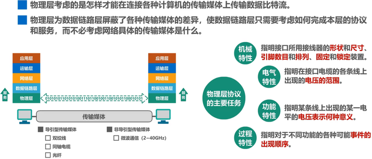

## 物理层的基本概念
>物理层的作用是解决在各种传输媒体中传输比特的问题，进而给数据链路层提供传输比特流的服务

## 传输方式

### 串行传输和并行传输

-   串行传输：发送方和接收方之间只有一条线路，每次发送一个比特
	- 

-   并行传输：发送方和接收方之间有N条线路，每次发送 N 个比特
	- 

-   并行传输速度快，但是成本高，抗干扰能力弱，远距离传输会有同步问题，一般用于近距离传输，比如操作系统内的总线就是串行传输
-   并行传输速度慢，但是稳定，常用于远距离传输

### 同步传输和异步传输

-   同步传输：比特流传输的每个字节之间没有间隔，连续传输
	
-   异步传输：传输的每一个字节之间的间隔不固定，发送方在每个字节的起始位置和结束位置做标记，接受方仅在每个字节的内部同步 

### 单向通信、双向交替通信（半双工）和双向同时通信（全双工）

-   单向通信：只能由一方传输数据，另一方只能接收，只需要一条信道，例如：广播
-   双向交替通信：双方都能传输数据，但是不能同时进行，需要两条信道，例如：对讲机
-   双向同时通信：双方都能传输数据，且能同时进行，需要两条信道，例如：电话

## 编码与调制

### 编码

#### 不归零编码（存在同步问题）

正电平表示1，负电平表示 0。这种编码在传输过程中无法标识码元的长度（何时开始，何时结束），因此，需要额外一根传输线路传输时钟信号，不实用。

例如：图中的两个连续负电平，接收方在没有时钟信号的情况下无法分辨这是两个码元还是三个码元。

#### 归零编码（自同步，但是编码效率低）

正电平表示1，负电平表示0，零电平表示一个码元的结束。归零编码的好处是自同步，不需要传输额外的时钟信号，缺点是带宽有二分之一用来传输零电平，编码效率低。

#### 曼彻斯特编码（码元中间时刻的跳变既表示时钟，也表示数据）

在每个码元的中间时刻会出现一次跳变，负跳变表示1，正跳变表示0，曼彻斯特编码也是传统以太网使用的编码（10Mb/s）。

#### 差分曼彻斯特编码

在每个码元的中间时刻都会出现一次跳动，但是这次跳动只表示时钟信息，根据码元开始处电平是否发生变化表示数据，没有变化表示1，有变化表示0。这种编码方式比曼彻斯特编码更适合用来高速传输数据。

### 调制

只做了解，不作笔记。

## 信道的极限容量

